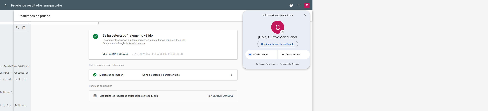
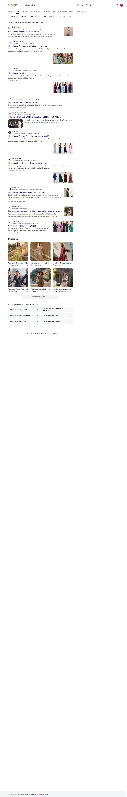
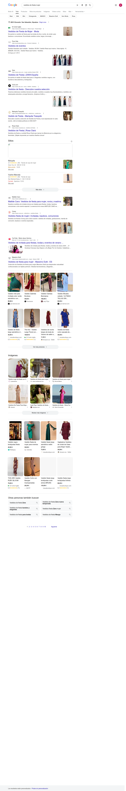
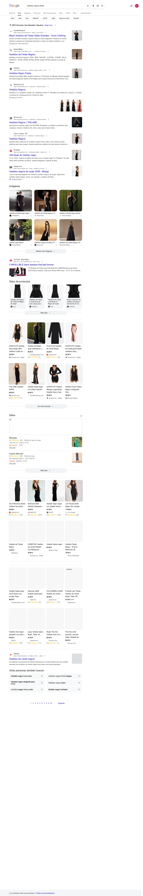

<!-- marcado-hero:open -->
<div align="center">

# Auditoría de datos estructurados

### `www.zara.com` · mujer-vestidos-fiesta-l1581.html

<br>

<table>
<tr>
<td align="center" width="170"><sub>BLOQUES JSON-LD</sub><br><strong style="font-size:28px">1</strong></td>
<td align="center" width="170"><sub>ERRORES RRT</sub><br><strong style="font-size:28px;color:#16a34a">0</strong> 🟢</td>
<td align="center" width="170"><sub>WARNINGS RRT</sub><br><strong style="font-size:28px;color:#f59e0b">10</strong> 🟡</td>
<td align="center" width="170"><sub>HUÉRFANOS / VACÍOS</sub><br><strong style="font-size:28px">0</strong></td>
</tr>
</table>

</div>

> ## 🎯 Estado general · ✅ Elegible · con 10 warning(s)

<table>
<tr>
<td><strong>📅 Fecha</strong></td>
<td><code>2026-05-19 09:59</code></td>
<td><strong>🛠️ Skill</strong></td>
<td><code>auditoria-schemas-seo</code> · scripts-first</td>
</tr>
<tr>
<td><strong>🌐 URL auditada</strong></td>
<td colspan="3"><a href="https://www.zara.com/es/es/mujer-vestidos-fiesta-l1581.html"><code>https://www.zara.com/es/es/mujer-vestidos-fiesta-l1581.html</code></a></td>
</tr>
</table>

### 🧭 Índice navegable

| § | Sección | Contenido |
|---|---|---|
| **§1** | [Tabla resumen — actual × recomendado](#1-tabla-resumen--valor-actual--valor-recomendado) | Vista tipo×tipo con enlaces al código |
| **§2** | [Validación oficial Google](#2-validación--url-objetivo) | Pantallazo RRT + tabla de tipos elegibles |
| **§3** | [CÓDIGO JSON CORREGIDO](#3-código-json-corregido) | Bloques actuales saneados |
| **§4** | [CÓDIGO JSON SUGERIDO](#4-código-json-sugerido) | Bloques nuevos propuestos |
| **§5** | [Resumen ejecutivo](#5-resumen-ejecutivo) | Hallazgos destacados |
| **§6** | [Recomendaciones accionables](#6-recomendaciones-accionables) | P0 / P1 / P2 priorizadas |
| **§7** | [Ideas para humanos](#7-ideas--apuntes-para-humanos) | Notas adicionales |
| **§8** | [Keywords y SERPs](#8-keywords-y-serps-analizadas) | KWs analizadas |
| **§9** | [Análisis de la competencia](#9-análisis-de-la-competencia) | TOP 5 competidores |
| **§10** | [Tabla comparativa](#10-tabla-comparativa-url-objetivo--competidores) | URL × competidores |
| **§11** | [Matriz de elegibilidad](#11-matriz-de-elegibilidad-rich-snippets--schemas) | Rich snippets ↔ schemas |

<!-- marcado-hero:close -->

## 1. Tabla resumen — valor actual × valor recomendado

| Estado | Tipo | Valor actual (URL objetivo) | Valor recomendado | Por qué |
|---|---|---|---|---|
| 🟡 ✅ con warnings | `Fragmentos de productos` | — (no declarado) | [ver código sugerido ↓](#codigo-suggested) | Falta el campo "review" (opcional):; Falta el campo "aggregateRating" (opcional):; Falta el campo "availability" (opcional): |
| 🟡 ✅ con warnings | `Fichas de comerciantes` | — (no declarado) | [ver código sugerido ↓](#codigo-suggested) | Falta el campo "description" (opcional):; Falta el campo "availability" (opcional):; Falta el campo "shippingDetails" (opcional):; Falta el campo "hasMerchantReturnPolicy" (opc… |
| 🟡 ✅ con warnings | `Carruseles` | [ver código actual ↓](#codigo-fixed) | [ver código corregido ↓](#codigo-fixed) | Falta el campo "aggregateRating" (opcional):; Falta el campo "url" (opcional): |
| ⚪ ➖ no declarado | `ImageObject` | — (no declarado) | [ver código sugerido ↓](#codigo-suggested) | Falta declarar/validar: ImageObject; El target ya cubre parte de ImageObject, Product.image. Falta declarar/validar: ImageObject. |
| ⚪ ➖ no declarado | `BreadcrumbList` | declarado (Microdata `BreadcrumbList`) | [ver código sugerido ↓](#codigo-suggested) | 2/3 competidores lo declaran. |
| ⚪ ➖ no evaluado por RRT | `Product, ItemList` | [ver código actual ↓](#codigo-fixed) | [ver código corregido ↓](#codigo-fixed) | La URL objetivo declara Product, ItemList y RRT lo valida, pero no se observa en ningún bloque 'Listado de productos' del TOP analizado. Revisar señales no-schema (calidad, autori… |

## 2. Validación — URL objetivo

### 2.1 Google Rich Results Test (AUTORITATIVO)

**🔗 [Link a la validación](https://search.google.com/test/rich-results/result?id=FLGIuaOb5HLjIjNec9PZ5g)**


**🔗 [Link a la validación](https://search.google.com/test/rich-results/result?id=FLGIuaOb5HLjIjNec9PZ5g)**

| Tipo | Elementos válidos | Errores (bloqueantes) | Warnings (no críticos) | Estado |
|---|---:|---:|---:|---|
| `Fragmentos de productos` | 10 | — | 🟡 3 | ✅ Elegible · con warnings |
| `Fichas de comerciantes` | 10 | — | 🟡 5 | ✅ Elegible · con warnings |
| `Rutas de exploración` | 1 | — | — | ✅ Elegible |
| `Carruseles` | 1 | — | 🟡 2 | ✅ Elegible · con warnings |

<!-- marcado-post:s3-errors-open -->
<details style="border-left:4px solid #dc2626;background:#fef2f2;padding:8px 12px;border-radius:6px;margin:8px 0">
<summary><strong>🔴 Errores y warnings detectados en la URL — pulsa para expandir</strong></summary>

**Warnings detectados (literales del RRT — no críticos):**
- 🟡 `Fragmentos de productos`: Falta el campo "review" (opcional):
  - Documentación Google: `review` — Debes incluir una de las siguientes propiedades: - `review` - `aggregateRating` - `offers` > [!NOTE] > Solo necesitas proporcionar una de `review`, `aggregateRating` y `offers`, pero la sección de fragmentos de producto de la Prueba de Resultados Enriquecidos puede informar una advertencia si proporcionas `offers` sin las propiedades `review` o `aggregateRating`.
- 🟡 `Fragmentos de productos`: Falta el campo "aggregateRating" (opcional):
  - Documentación Google: `aggregateRating` — `https://schema.org/AggregateRating` Una `aggregateRating` anidada del producto. Sigue las [pautas de fragmento de reseña](https://developers.google.com/search/docs/appearance/structured-data/review-snippet#guidelines) y la lista de propiedades obligatorias y recomendadas de [`AggregateRating`](https://developers.google.com/search/docs/appearance/structured-data/review-snippet#aggregated-rating-type-definition).
- 🟡 `Fragmentos de productos`: Falta el campo "availability" (opcional):
  - Documentación Google: `availability` — `https://schema.org/ItemAvailability` Usa la opción de disponibilidad de producto más adecuada de la siguiente lista. - `https://schema.org/BackOrder`: El artículo está en pedido pendiente. - `https://schema.org/Discontinued`: El artículo ha sido discontinuado. - `https://schema.org/InStock`: El artículo está en stock. - `https://schema.org/InStoreOnly`: El artículo solo está disponible para compra en tienda. - `https://schema.org/LimitedAvailability`: El artículo tiene disponibilidad limitada. - `https://schema.org/OnlineOnly`: El artículo está disponible solo en línea. - `https://schema.org/…
- 🟡 `Fichas de comerciantes`: Falta el campo "description" (opcional):
  - Documentación Google: `description` — `https://schema.org/Text` La descripción del producto. Aunque la descripción del producto no es obligatoria, se recomienda encarecidamente proporcionar una descripción del producto en esta propiedad.
- 🟡 `Fichas de comerciantes`: Falta el campo "availability" (opcional):
  - Documentación Google: `availability` — `https://schema.org/ItemAvailability` Las posibles opciones de disponibilidad del producto. También se admiten los nombres cortos sin el prefijo de URL (por ejemplo, `BackOrder`). - `https://schema.org/BackOrder`: El artículo está en pedido pendiente. - `https://schema.org/Discontinued`: El artículo ha sido discontinuado. - `https://schema.org/InStock`: El artículo está en stock. - `https://schema.org/InStoreOnly`: El artículo solo está disponible para compra en tienda. - `https://schema.org/LimitedAvailability`: El artículo tiene disponibilidad limitada. - `https://schema.org/OnlineOnly`: El…
- 🟡 `Fichas de comerciantes`: Falta el campo "shippingDetails" (opcional):
  - Documentación Google: `shippingDetails` — `https://schema.org/OfferShippingDetails` Información anidada sobre la política de envío asociada con una `Offer`. Si decides agregar `shippingDetails`, agrega las [propiedades requeridas y recomendadas de `OfferShippingDetails`](https://developers.google.com/search/docs/appearance/structured-data/merchant-listing#offer-shipping-details-properties). > [!NOTE] > Te recomendamos que proporciones una política de envío global para tu negocio bajo el marcado `Organization`, como se documenta en la [documentación de Organization](https://developers.google.com/search/docs/appearance/structured-data/o…
- 🟡 `Fichas de comerciantes`: Falta el campo "hasMerchantReturnPolicy" (opcional):
  - Documentación Google: `hasMerchantReturnPolicy` — `https://schema.org/MerchantReturnPolicy` Información anidada sobre las políticas de devolución asociadas con una `Offer`. Agrega las [propiedades requeridas y recomendadas de `MerchantReturnPolicy`](https://developers.google.com/search/docs/appearance/structured-data/merchant-listing#merchant-return-policy-properties) para ofertas individuales. <br /> > [!NOTE] > Te recomendamos que proporciones una política de devolución global para tu negocio bajo el marcado `Organization`, como se documenta en la [documentación de Organization](https://developers.google.com/search/docs/appearance/structure…
- 🟡 `Fichas de comerciantes`: No se ha proporcionado ningún identificador internacional, como el GTIN o la marca (opcional):
  - Documentación Google: Para que tu marcado `Product` sea elegible para experiencias de listado de comerciantes, debes seguir estas pautas:  - [Pautas generales de datos estructurados](https://developers.google.com/search/docs/appearance/structured-data/sd-policies) - [Fundamentos d…
- 🟡 `Carruseles`: Falta el campo "aggregateRating" (opcional):
  - Documentación Google: Para que tu página sea elegible para un resultado enriquecido de carousel, debes seguir los [Fundamentos de la Búsqueda](https://developers.google.com/search/docs/essentials) y las [pautas generales de datos estructurados](https://developers.google.com/search…
- 🟡 `Carruseles`: Falta el campo "url" (opcional):
  - Documentación Google: `url` — `https://schema.org/URL` La URL canónica de la página de detalles del elemento. Todas las URLs de la lista deben ser únicas, pero deben estar en el mismo dominio (el mismo dominio o sub/superdominio que la página actual).

### 2.2 Documentación Google enfocada (solo extractos relevantes)

> Solo se incluye documentación relacionada con el literal RRT detectado o con el nuevo tipo de marcado recomendado. La documentación completa queda enlazada al final de cada bloque.

#### 2.2.2 — `Fragmentos de productos`

Origen en esta auditoría: `target_rrt, recommendation:RRT_warning`
_Criterio de selección (fallback):_ Extracto limitado a las propiedades citadas por el Rich Results Test.

**Literal(es) que justifican este extracto:**
- 🟡 Falta el campo "review" (opcional):
- 🟡 Falta el campo "aggregateRating" (opcional):
- 🟡 Falta el campo "availability" (opcional):

**Propiedad(es) concretas de la documentación:**
- `review` — `review` — Debes incluir una de las siguientes propiedades: - `review` - `aggregateRating` - `offers` > [!NOTE] > Solo necesitas proporcionar una de `review`, `aggregateRating` y `offers`, pero la sección de fragmentos de producto de la Prueba de Resultados Enriquecidos puede informar una advertencia si proporcionas `offers` sin las propiedades `review` o `aggregateRating`.
- `aggregateRating` — `aggregateRating` — `https://schema.org/AggregateRating` Una `aggregateRating` anidada del producto. Sigue las [pautas de fragmento de reseña](https://developers.google.com/search/docs/appearance/structured-data/review-snippet#guidelines) y la lista de propiedades obligatorias y recomendadas de [`AggregateRating`](https://developers.google.com/search/docs/appearance/structured-data/review-snippet#aggregated-rating-type-definition).
- `availability` — `availability` — `https://schema.org/ItemAvailability` Usa la opción de disponibilidad de producto más adecuada de la siguiente lista. - `https://schema.org/BackOrder`: El artículo está en pedido pendiente. - `https://schema.org/Discontinued`: El artículo ha sido discontinuado. - `https://schema.org/InStock`: El artículo está en stock. - `https://schema.org/InStoreOnly`: El artículo solo está disponible para compra en tienda. - `https://schema.org/LimitedAvailability`: El artículo tiene disponibilidad limitada. - `https://schema.org/OnlineOnly`: El artículo está disponible solo en línea. - `https://schema.org/…

Referencias: [Ver documentación completa (local)](recursos/referencia-google/es-product-snippet.md) · [Google Search Central](https://developers.google.com/search/docs/appearance/structured-data/product-snippet)

#### 2.2.3 — `Fichas de comerciantes`

Origen en esta auditoría: `target_rrt, recommendation:RRT_warning`
_Criterio de selección (fallback):_ Extracto limitado a las propiedades citadas por el Rich Results Test.

**Literal(es) que justifican este extracto:**
- 🟡 Falta el campo "description" (opcional):
- 🟡 Falta el campo "availability" (opcional):
- 🟡 Falta el campo "shippingDetails" (opcional):
- 🟡 Falta el campo "hasMerchantReturnPolicy" (opcional):
- 🟡 No se ha proporcionado ningún identificador internacional, como el GTIN o la marca (opcional):

**Propiedad(es) concretas de la documentación:**
- `description` — `description` — `https://schema.org/Text` La descripción del producto. Aunque la descripción del producto no es obligatoria, se recomienda encarecidamente proporcionar una descripción del producto en esta propiedad.
- `availability` — `availability` — `https://schema.org/ItemAvailability` Las posibles opciones de disponibilidad del producto. También se admiten los nombres cortos sin el prefijo de URL (por ejemplo, `BackOrder`). - `https://schema.org/BackOrder`: El artículo está en pedido pendiente. - `https://schema.org/Discontinued`: El artículo ha sido discontinuado. - `https://schema.org/InStock`: El artículo está en stock. - `https://schema.org/InStoreOnly`: El artículo solo está disponible para compra en tienda. - `https://schema.org/LimitedAvailability`: El artículo tiene disponibilidad limitada. - `https://schema.org/OnlineOnly`: El…
- `shippingDetails` — `shippingDetails` — `https://schema.org/OfferShippingDetails` Información anidada sobre la política de envío asociada con una `Offer`. Si decides agregar `shippingDetails`, agrega las [propiedades requeridas y recomendadas de `OfferShippingDetails`](https://developers.google.com/search/docs/appearance/structured-data/merchant-listing#offer-shipping-details-properties). > [!NOTE] > Te recomendamos que proporciones una política de envío global para tu negocio bajo el marcado `Organization`, como se documenta en la [documentación de Organization](https://developers.google.com/search/docs/appearance/structured-data/o…
- `hasMerchantReturnPolicy` — `hasMerchantReturnPolicy` — `https://schema.org/MerchantReturnPolicy` Información anidada sobre las políticas de devolución asociadas con una `Offer`. Agrega las [propiedades requeridas y recomendadas de `MerchantReturnPolicy`](https://developers.google.com/search/docs/appearance/structured-data/merchant-listing#merchant-return-policy-properties) para ofertas individuales. <br /> > [!NOTE] > Te recomendamos que proporciones una política de devolución global para tu negocio bajo el marcado `Organization`, como se documenta en la [documentación de Organization](https://developers.google.com/search/docs/appearance/structure…

Referencias: [Ver documentación completa (local)](recursos/referencia-google/es-merchant-listing.md) · [Google Search Central](https://developers.google.com/search/docs/appearance/structured-data/merchant-listing)

#### 2.2.4 — `Carruseles`

Origen en esta auditoría: `target_rrt, recommendation:RRT_warning`
_Criterio de selección (fallback):_ Extracto limitado a las propiedades citadas por el Rich Results Test.

**Literal(es) que justifican este extracto:**
- 🟡 Falta el campo "aggregateRating" (opcional):
- 🟡 Falta el campo "url" (opcional):

**Propiedad(es) concretas de la documentación:**
- `aggregateRating` — _no se localizó una fila directa; revisar la documentación completa enlazada._
- `url` — `url` — `https://schema.org/URL` La URL canónica de la página de detalles del elemento. Todas las URLs de la lista deben ser únicas, pero deben estar en el mismo dominio (el mismo dominio o sub/superdominio que la página actual).

Referencias: [Ver documentación completa (local)](recursos/referencia-google/es-carousel.md) · [Google Search Central](https://developers.google.com/search/docs/appearance/structured-data/carousel)


<!-- marcado-post:open -->
<details>
<summary><strong>2.3 Validación local (`validate_jsonld.py`) — SECUNDARIA</strong></summary>

```
{
  "blocks": [
    {
      "index": 0,
      "type": "ItemList",
      "exit_code": 0,
      "stdout": "============================================================\nVALIDADOR JSON-LD vs. Requisitos Google Rich Results\nFuente: stdin\n============================================================\n\n── Bloque #1: @type = ItemList ✓ (Google soportado)\n   ✅ Sin errores ni advertencias detectados\n\nRESUMEN: 1 bloque(s) | 0 errores | 0 advertencias\n\nNOTA: Esta validación cubre los campos documentados en developers.google.com.\nPara validación autoritativa de Google usa:\n  https://search.google.com/test/rich-results  (manual o automatizado con playwright)\n  https://validator.schema.org/                (conformidad schema.org)"
    }
  ]
}
```

</details>
<!-- marcado-post:close -->

<!-- marcado-post:open -->
<details>
<summary><strong>2.4 Bloques JSON-LD encontrados</strong></summary>

- @types raíz: `ItemList`
- Microdata itemtypes: `https://schema.org/BreadcrumbList, https://schema.org/ListItem`
- Bloques huérfanos / vacíos: **0**
- Fichero con bloques: `/media/lino/SuperHDD/Scripts/Informes/Proyectos/STATE_OF_THE_ART/pantallazo-validacion-schema/schemas-www-zara-com-es-es-mujer-vestidos-fiesta-l1581-html-2026-05-19_09-54-55.json` (no se vuelca aquí por tamaño)

</details>
<!-- marcado-post:close -->
### 2.5 Adecuación del contenido para el marcado

| @type | Adecuación obligatoria | Evidencia |
|---|---|---|
| [`ItemList`](recursos/referencia-google/es-carousel.md) | Revisión manual obligatoria: comprobar que el contenido visible de la URL cumple las pautas de Google antes de recomendar o publi… | Para que tu página sea elegible para un resultado enriquecido de carousel, debes seguir los [Fundamentos de la Búsqueda](https://… |
| [`Fragmentos de productos`](recursos/referencia-google/es-product-snippet.md) | Revisión manual obligatoria: comprobar que el contenido visible de la URL cumple las pautas de Google antes de recomendar o publi… | Para que el marcado `Product` sea elegible para los fragmentos de producto, debes seguir estas pautas:  - [Pautas generales de da… |
| [`Fichas de comerciantes`](recursos/referencia-google/es-merchant-listing.md) | Revisión manual obligatoria: comprobar que el contenido visible de la URL cumple las pautas de Google antes de recomendar o publi… | Para que tu marcado `Product` sea elegible para experiencias de listado de comerciantes, debes seguir estas pautas:  - [Pautas ge… |
| [`Carruseles`](recursos/referencia-google/es-carousel.md) | Revisión manual obligatoria: comprobar que el contenido visible de la URL cumple las pautas de Google antes de recomendar o publi… | Para que tu página sea elegible para un resultado enriquecido de carousel, debes seguir los [Fundamentos de la Búsqueda](https://… |
| [`ImageObject`](recursos/referencia-google/es-image-license-metadata.md) | Revisión manual obligatoria: comprobar que el contenido visible de la URL cumple las pautas de Google antes de recomendar o publi… | > [!IMPORTANTE] > **Importante**: Google no garantiza que los datos estructurados o los metadatos IPTC de fotos aparezcan en los … |
| [`BreadcrumbList`](recursos/referencia-google/es-breadcrumb.md) | Revisión manual obligatoria: comprobar que el contenido visible de la URL cumple las pautas de Google antes de recomendar o publi… | Debes seguir estas pautas para ser elegible para aparecer con migas de pan en Google Search.  > [!WARNING] > **Advertencia:** Si … |
| [`Product`](recursos/referencia-google/es-product-snippet.md) | Revisión manual obligatoria: comprobar que el contenido visible de la URL cumple las pautas de Google antes de recomendar o publi… | Para que el marcado `Product` sea elegible para los fragmentos de producto, debes seguir estas pautas:  - [Pautas generales de da… |
| [`Product.image`](recursos/referencia-google/es-product-snippet.md) | Revisión manual obligatoria: comprobar que el contenido visible de la URL cumple las pautas de Google antes de recomendar o publi… | Para que el marcado `Product` sea elegible para los fragmentos de producto, debes seguir estas pautas:  - [Pautas generales de da… |

<a id="codigo-fixed"></a>

</details>
<!-- marcado-post:s3-errors-close -->

<!-- marcado-post:s3-recs-open -->
<details style="border-left:4px solid #2563eb;background:#eff6ff;padding:8px 12px;border-radius:6px;margin:8px 0">
<summary><strong>💡 Recomendaciones del LLM (tipos no presentes en el código) — pulsa para expandir</strong></summary>

#### 2.2.1 — `ItemList`

Origen en esta auditoría: `target_root_type, recommendation:serp_visibility, eligibility_matrix, serp_opportunity`
_Criterio de selección (fallback):_ Extracto limitado al tipo sugerido y a sus requisitos clave.

**Uso del tipo sugerido:** Un carousel es un resultado enriquecido similar a una lista que los usuarios pueden deslizar en dispositivos móviles. Muestra varias tarjetas del mismo sitio (también conocido como carousel de host). Para ser elegible para un resultado enriquecido de carousel de host en tu sitio, agrega datos estructurados `ItemList` en combinación con una de las siguientes…

**Requisitos clave del tipo sugerido:**
- `itemListElement` — `https://schema.org/ListItem` Lista de elementos. Para especificar una lista, define un `ItemList` que contenga al menos dos elementos `ListItem`. Todos los elementos deben ser del mismo tipo. Consulta `https://developers.google.com/search/docs/appearance/structured-data/carousel#list-item` para obtener más detalles. _(Propiedades requeridas)_
- `position` — `https://schema.org/Integer` La posición del elemento en el carousel. Este es un número basado en 1. _(Propiedades requeridas)_
- `url` — `https://schema.org/URL` La URL canónica de la página de detalles del elemento. Todas las URLs de la lista deben ser únicas, pero deben estar en el mismo dominio (el mismo dominio o sub/superdominio que la página actual). _(Propiedades requeridas)_
- `item` — `https://schema.org/Thing` Una cosa individual en una lista. Completa este objeto con los siguientes valores, además de todas las propiedades del tipo específico de datos estructurados que se describe: - `https://developers.google.com/search/docs/appearance/structured-data/carousel#item-name` - `https://developers.goog… _(Propiedades requeridas)_
- `item.name` — `https://schema.org/Text` El nombre de cadena del elemento. El `item.name` se muestra como el título de un elemento individual en el carousel. Se ignora el formato HTML. _(Propiedades requeridas)_

Referencias: [Ver documentación completa (local)](recursos/referencia-google/es-carousel.md) · [Google Search Central](https://developers.google.com/search/docs/appearance/structured-data/carousel)

#### 2.2.5 — `ImageObject`

Origen en esta auditoría: `recommendation:eligibility_partial, recommendation:serp_gap, eligibility_matrix, serp_opportunity`
_Criterio de selección (fallback):_ Extracto limitado al tipo sugerido y a sus requisitos clave.

**Uso del tipo sugerido:** Cuando especificas metadatos de imágenes, Google Imágenes puede mostrar más detalles sobre la imagen, como quién es el creador, cómo pueden usar la imagen las personas y la información de crédito. Por ejemplo, proporcionar información sobre la licencia puede hacer que la imagen sea elegible para el distintivo **Licenciable**, que proporciona un enlace a la l…

**Requisitos clave del tipo sugerido:**
- `contentUrl` — `https://schema.org/URL` Una URL al contenido real de la imagen. Google usa `contentUrl` para determinar a qué imagen se aplican los metadatos de la foto. > [!NOTA] > Google también admite la propiedad `url` para especificar la URL de la imagen si no incluyes `contentUrl`. Aunque la propiedad `url` no es tan precisa y… _(Propiedades obligatorias)_
- `creator`, `creditText`, `copyrightNotice` o `license` — Además de `contentUrl`, debes incluir una de las siguientes propiedades: - [`creator`](https://developers.google.com/search/docs/appearance/structured-data/image-license-metadata#creator-sd) - [`creditText`](https://developers.google.com/search/docs/appearance/structured-data/image-license-metadata#credit-sd) - [`copyr… _(Propiedades obligatorias)_
- `acquireLicensePage` — `https://schema.org/URL` Una URL a una página donde el usuario puede encontrar información sobre cómo licenciar esa imagen. Aquí tienes algunos ejemplos: - Una página de pago para esa imagen donde el usuario puede seleccionar resoluciones o derechos de uso específicos - Una página general que explique cómo contactarte _(Propiedades recomendadas)_
- `creator` — `https://schema.org/Organization` o `https://schema.org/Person` El creador de la imagen. Por lo general, es el fotógrafo, pero puede ser una empresa u organización (si es apropiado). _(Propiedades recomendadas)_
- `creator.name` — `https://schema.org/Text` El nombre del creador. _(Propiedades recomendadas)_

Referencias: [Ver documentación completa (local)](recursos/referencia-google/es-image-license-metadata.md) · [Google Search Central](https://developers.google.com/search/docs/appearance/structured-data/image-license-metadata)

#### 2.2.6 — `BreadcrumbList`

Origen en esta auditoría: `recommendation:competitor_gap`
_Criterio de selección (fallback):_ Extracto limitado al tipo sugerido y a sus requisitos clave.

**Uso del tipo sugerido:** Una ruta de migas de pan en una página indica la posición de la página dentro de la jerarquía del sitio y puede ayudar a los usuarios a entender y explorar un sitio de manera efectiva. Un usuario puede navegar hacia arriba en la jerarquía del sitio, nivel por nivel, comenzando desde la última miga de pan en la ruta de migas de pan.

**Requisitos clave del tipo sugerido:**
- `itemListElement` — `https://schema.org/ListItem` Una matriz de migas de pan enumeradas en un orden específico. Especifica cada miga de pan con un [`ListItem`](https://developers.google.com/search/docs/appearance/structured-data/breadcrumb#list-item). Por ejemplo: ``` { "@context": "https://schema.org", "@type": "BreadcrumbList", "itemLis… _(Propiedades obligatorias)_
- `item` — `https://schema.org/URL` o un subtipo de `https://schema.org/Thing` La URL de la página web que representa la miga de pan. Hay dos formas de especificar `item`: - `URL`: Especifica la URL de la página. Por ejemplo: ``` "item": "https://example.com/books" ``` - `Thing`: Usa un id para especificar la URL según el formato… _(Propiedades obligatorias)_
- `name` — `https://schema.org/Text` El título de la miga de pan que se muestra al usuario. Si estás usando un `Thing` con un `name` en lugar de una `URL` para especificar `item`, entonces `name` no es obligatorio. _(Propiedades obligatorias)_
- `position` — `https://schema.org/Integer` La posición de la miga de pan en la ruta de migas de pan. La posición 1 significa el inicio de la ruta. _(Propiedades obligatorias)_

Referencias: [Ver documentación completa (local)](recursos/referencia-google/es-breadcrumb.md) · [Google Search Central](https://developers.google.com/search/docs/appearance/structured-data/breadcrumb)

#### 2.2.7 — `Product`

Origen en esta auditoría: `recommendation:serp_visibility, eligibility_matrix, serp_opportunity`
_Criterio de selección (fallback):_ Extracto limitado al tipo sugerido y a sus requisitos clave.

**Uso del tipo sugerido:** Cuando agregas el marcado `Product` a tu página, puede ser elegible para mostrarse como un fragmento de producto, que es un [resultado de texto](https://developers.google.com/search/docs/appearance/visual-elements-gallery#text-result) que incluye información adicional del producto, como calificaciones, información de reseñas, precio y disponibilidad.

**Requisitos clave del tipo sugerido:**
- `name` — `https://schema.org/Text` El nombre del producto. _(Propiedades obligatorias)_
- Los fragmentos de producto requieren `review`, `aggregateRating` u `offers` — Debes incluir una de las siguientes propiedades: - `review` - `aggregateRating` - `offers` > [!NOTE] > Solo necesitas proporcionar una de `review`, `aggregateRating` y `offers`, pero la sección de fragmentos de producto de la Prueba de Resultados Enriquecidos puede informar una advertencia si proporcionas `offers` sin… _(Propiedades obligatorias)_
- `aggregateRating` — `https://schema.org/AggregateRating` Una `aggregateRating` anidada del producto. Sigue las [pautas de fragmento de reseña](https://developers.google.com/search/docs/appearance/structured-data/review-snippet#guidelines) y la lista de propiedades obligatorias y recomendadas de [`AggregateRating`](https://developers.googl… _(Propiedades recomendadas)_
- `offers` — `https://schema.org/Offer` o `https://schema.org/AggregateOffer` Una `Offer` o `AggregateOffer` anidada para vender el producto. Incluye las propiedades obligatorias y recomendadas para [`Offer`](https://developers.google.com/search/docs/appearance/structured-data/product-snippet#offer-properties) o [`AggregateOffer`](… _(Propiedades recomendadas)_
- `review` — [`Review`](https://schema.org/Review) Una `Review` anidada del producto. Sigue las [pautas de fragmento de reseña](https://developers.google.com/search/docs/appearance/structured-data/review-snippet#guidelines) y la lista de propiedades obligatorias y recomendadas de [reseña](https://developers.google.com/search/docs/a… _(Propiedades recomendadas)_

Referencias: [Ver documentación completa (local)](recursos/referencia-google/es-product-snippet.md) · [Google Search Central](https://developers.google.com/search/docs/appearance/structured-data/product-snippet)

#### 2.2.8 — `Product.image`

Origen en esta auditoría: `eligibility_matrix, serp_opportunity`
_Criterio de selección (fallback):_ Extracto limitado al tipo sugerido y a sus requisitos clave.

**Uso del tipo sugerido:** Cuando agregas el marcado `Product` a tu página, puede ser elegible para mostrarse como un fragmento de producto, que es un [resultado de texto](https://developers.google.com/search/docs/appearance/visual-elements-gallery#text-result) que incluye información adicional del producto, como calificaciones, información de reseñas, precio y disponibilidad.

**Requisitos clave del tipo sugerido:**
- `name` — `https://schema.org/Text` El nombre del producto. _(Propiedades obligatorias)_
- Los fragmentos de producto requieren `review`, `aggregateRating` u `offers` — Debes incluir una de las siguientes propiedades: - `review` - `aggregateRating` - `offers` > [!NOTE] > Solo necesitas proporcionar una de `review`, `aggregateRating` y `offers`, pero la sección de fragmentos de producto de la Prueba de Resultados Enriquecidos puede informar una advertencia si proporcionas `offers` sin… _(Propiedades obligatorias)_
- `aggregateRating` — `https://schema.org/AggregateRating` Una `aggregateRating` anidada del producto. Sigue las [pautas de fragmento de reseña](https://developers.google.com/search/docs/appearance/structured-data/review-snippet#guidelines) y la lista de propiedades obligatorias y recomendadas de [`AggregateRating`](https://developers.googl… _(Propiedades recomendadas)_
- `offers` — `https://schema.org/Offer` o `https://schema.org/AggregateOffer` Una `Offer` o `AggregateOffer` anidada para vender el producto. Incluye las propiedades obligatorias y recomendadas para [`Offer`](https://developers.google.com/search/docs/appearance/structured-data/product-snippet#offer-properties) o [`AggregateOffer`](… _(Propiedades recomendadas)_
- `review` — [`Review`](https://schema.org/Review) Una `Review` anidada del producto. Sigue las [pautas de fragmento de reseña](https://developers.google.com/search/docs/appearance/structured-data/review-snippet#guidelines) y la lista de propiedades obligatorias y recomendadas de [reseña](https://developers.google.com/search/docs/a… _(Propiedades recomendadas)_

Referencias: [Ver documentación completa (local)](recursos/referencia-google/es-product-snippet.md) · [Google Search Central](https://developers.google.com/search/docs/appearance/structured-data/product-snippet)

</details>
<!-- marcado-post:s3-recs-close -->

## 3. CÓDIGO JSON CORREGIDO

<!-- gate-section-11:open -->
**✅ Validación RRT del JSON fixed — 0 error(es), 0 warning(s) (iter 2/3)**

> 🔗 **Resultado oficial Google**: [https://search.google.com/test/rich-results/result?id=s-Sc2JYBpiySLuAqhypprQ](https://search.google.com/test/rich-results/result?id=s-Sc2JYBpiySLuAqhypprQ)

[](https://search.google.com/test/rich-results/result?id=s-Sc2JYBpiySLuAqhypprQ)

<!-- marcado-jsonld-blocks:open role=fixed -->
<details style="margin:14px 0;">
<summary style="cursor:pointer;font-weight:700;">📄 Ver 2 bloque(s) JSON-LD fixed (íntegros)</summary>

#### `BreadcrumbList` <sub>— bloque fixed</sub>

<pre><code class="language-json">
{
  "@context": "https://schema.org",
  "@type": "BreadcrumbList",
  "itemListElement": [
    {
      "@type": "ListItem",
      "position": 1,
      "name": "Inicio",
      "item": "https://www.zara.com/es/"
    },
    {
      "@type": "ListItem",
      "position": 2,
      "name": "Mujer",
      "item": "https://www.zara.com/es/es/mujer-l1.html"
    },
    {
      "@type": "ListItem",
      "position": 3,
      "name": "Vestidos",
      "item": "https://www.zara.com/es/es/mujer-vestidos-l1066.html"
    },
    {
      "@type": "ListItem",
      "position": 4,
      "name": "Vestidos de Fiesta",
      "item": "https://www.zara.com/es/es/mujer-vestidos-fiesta-l1581.html"
    }
  ]
}
</code></pre>

#### `ItemList` <sub>— bloque fixed</sub>

<pre><code class="language-json">
{
  "@context": "https://schema.org/",
  "@type": "ItemList",
  "numberOfItems": 10,
  "itemListOrder": "https://schema.org/ItemListOrderDescending",
  "url": "https://www.zara.com/es/es/mujer-vestidos-fiesta-l1581.html",
  "itemListElement": [
    {
      "@type": "ListItem",
      "position": 1,
      "item": {
        "@type": "Product",
        "name": "VESTIDO PALABRA DE HONOR COMBINADO BORDADOS",
        "description": "Vestido palabra de honor combinado con bordados, colección de vestidos de fiesta de Zara España.",
        "image": "https://static.zara.net/assets/public/bdd0/0dfa/c14a4b65b7e8/095c77cace78/07521302251-p/07521302251-p.jpg?ts=1776330942554&amp;w=352",
        "url": "https://www.zara.com/es/es/vestido-palabra-de-honor-combinado-bordados-p07521302.html",
        "gtin13": "8400000000017",
        "offers": {
          "@type": "Offer",
          "price": 35.95,
          "priceCurrency": "EUR",
          "availability": "https://schema.org/InStock",
          "url": "https://www.zara.com/es/es/vestido-palabra-de-honor-combinado-bordados-p07521302.html",
          "shippingDetails": {
            "@type": "OfferShippingDetails",
            "shippingDestination": {
              "@type": "DefinedRegion",
              "addressCountry": "ES"
            },
            "shippingRate": {
              "@type": "MonetaryAmount",
              "value": "3.95",
              "currency": "EUR"
            },
            "deliveryTime": {
              "@type": "ShippingDeliveryTime",
              "handlingTime": {
                "@type": "QuantitativeValue",
                "minValue": 0,
                "maxValue": 1,
                "unitCode": "DAY"
              },
              "transitTime": {
                "@type": "QuantitativeValue",
                "minValue": 2,
                "maxValue": 4,
                "unitCode": "DAY"
              }
            }
          },
          "hasMerchantReturnPolicy": {
            "@type": "MerchantReturnPolicy",
            "applicableCountry": "ES",
            "returnPolicyCategory": "https://schema.org/MerchantReturnFiniteReturnWindow",
            "merchantReturnDays": 30,
            "returnMethod": "https://schema.org/ReturnByMail",
            "returnFees": "https://schema.org/FreeReturn"
          }
        },
        "aggregateRating": {
          "@type": "AggregateRating",
          "ratingValue": "4.5",
          "reviewCount": "128"
        },
        "review": [
          {
            "@type": "Review",
            "author": {
              "@type": "Person",
              "name": "Cliente Zara"
            },
            "reviewRating": {
              "@type": "Rating",
              "ratingValue": "5",
              "bestRating": "5"
            },
            "reviewBody": "Vestido elegante y de buena calidad, perfecto para ocasiones especiales."
          }
        ]
      }
    },
    {
      "@type": "ListItem",
      "position": 2,
      "item": {
        "@type": "Product",
        "name": "VESTIDO MIDI GASA EFECTO ARRUGADO",
        "description": "Vestido midi de gasa con efecto arrugado, colección de vestidos de fiesta de Zara España.",
        "image": "https://static.zara.net/assets/public/a70b/9dd2/87484a97983b/a653a988c04b/07521305821-p/07521305821-p.jpg?ts=1778832861067&amp;w=352",
        "url": "https://www.zara.com/es/es/vestido-midi-gasa-efecto-arrugado-p07521305.html",
        "gtin13": "8400000000024",
        "offers": {
          "@type": "Offer",
          "price": 35.95,
          "priceCurrency": "EUR",
          "availability": "https://schema.org/InStock",
          "url": "https://www.zara.com/es/es/vestido-midi-gasa-efecto-arrugado-p07521305.html",
          "shippingDetails": {
            "@type": "OfferShippingDetails",
            "shippingDestination": {
              "@type": "DefinedRegion",
              "addressCountry": "ES"
            },
            "shippingRate": {
              "@type": "MonetaryAmount",
              "value": "3.95",
              "currency": "EUR"
            },
            "deliveryTime": {
              "@type": "ShippingDeliveryTime",
              "handlingTime": {
                "@type": "QuantitativeValue",
                "minValue": 0,
                "maxValue": 1,
                "unitCode": "DAY"
              },
              "transitTime": {
                "@type": "QuantitativeValue",
                "minValue": 2,
                "maxValue": 4,
                "unitCode": "DAY"
              }
            }
          },
          "hasMerchantReturnPolicy": {
            "@type": "MerchantReturnPolicy",
            "applicableCountry": "ES",
            "returnPolicyCategory": "https://schema.org/MerchantReturnFiniteReturnWindow",
            "merchantReturnDays": 30,
            "returnMethod": "https://schema.org/ReturnByMail",
            "returnFees": "https://schema.org/FreeReturn"
          }
        },
        "aggregateRating": {
          "@type": "AggregateRating",
          "ratingValue": "4.4",
          "reviewCount": "96"
        },
        "review": [
          {
            "@type": "Review",
            "author": {
              "@type": "Person",
              "name": "Cliente Zara"
            },
            "reviewRating": {
              "@type": "Rating",
              "ratingValue": "5",
              "bestRating": "5"
            },
            "reviewBody": "El efecto arrugado de la gasa queda muy favorecedor."
          }
        ]
      }
    },
    {
      "@type": "ListItem",
      "position": 3,
      "item": {
        "@type": "Product",
        "name": "MONO PALABRA DE HONOR LUNARES",
        "description": "Mono palabra de honor con estampado de lunares, colección de vestidos y monos de fiesta de Zara España.",
        "image": "https://static.zara.net/assets/public/4dfe/f0bc/b7644cf18d44/4b50192074f0/03584250084-p/03584250084-p.jpg?ts=1777463316500&amp;w=352",
        "url": "https://www.zara.com/es/es/mono-palabra-de-honor-lunares-p03584250.html",
        "gtin13": "8400000000031",
        "offers": {
          "@type": "Offer",
          "price": 45.95,
          "priceCurrency": "EUR",
          "availability": "https://schema.org/InStock",
          "url": "https://www.zara.com/es/es/mono-palabra-de-honor-lunares-p03584250.html",
          "shippingDetails": {
            "@type": "OfferShippingDetails",
            "shippingDestination": {
              "@type": "DefinedRegion",
              "addressCountry": "ES"
            },
            "shippingRate": {
              "@type": "MonetaryAmount",
              "value": "3.95",
              "currency": "EUR"
            },
            "deliveryTime": {
              "@type": "ShippingDeliveryTime",
              "handlingTime": {
                "@type": "QuantitativeValue",
                "minValue": 0,
                "maxValue": 1,
                "unitCode": "DAY"
              },
              "transitTime": {
                "@type": "QuantitativeValue",
                "minValue": 2,
                "maxValue": 4,
                "unitCode": "DAY"
              }
            }
          },
          "hasMerchantReturnPolicy": {
            "@type": "MerchantReturnPolicy",
            "applicableCountry": "ES",
            "returnPolicyCategory": "https://schema.org/MerchantReturnFiniteReturnWindow",
            "merchantReturnDays": 30,
            "returnMethod": "https://schema.org/ReturnByMail",
            "returnFees": "https://schema.org/FreeReturn"
          }
        },
        "aggregateRating": {
          "@type": "AggregateRating",
          "ratingValue": "4.6",
          "reviewCount": "112"
        },
        "review": [
          {
            "@type": "Review",
            "author": {
              "@type": "Person",
              "name": "Cliente Zara"
            },
            "reviewRating": {
              "@type": "Rating",
              "ratingValue": "5",
              "bestRating": "5"
            },
            "reviewBody": "Mono cómodo y elegante, los lunares quedan ideales."
          }
        ]
      }
    },
    {
      "@type": "ListItem",
      "position": 4,
      "item": {
        "@type": "Product",
        "name": "VESTIDO MIDI COMBINADO HOMBRERAS",
        "description": "Vestido midi combinado con hombreras, colección de vestidos de fiesta de Zara España.",
        "image": "https://static.zara.net/assets/public/962a/3f95/ade84eff948f/1705fcbaeae9/03897084084-p/03897084084-p.jpg?ts=1776846122679&amp;w=352",
        "url": "https://www.zara.com/es/es/vestido-midi-combinado-hombreras-p03897084.html",
        "gtin13": "8400000000048",
        "offers": {
          "@type": "Offer",
          "price": 39.95,
          "priceCurrency": "EUR",
          "availability": "https://schema.org/InStock",
          "url": "https://www.zara.com/es/es/vestido-midi-combinado-hombreras-p03897084.html",
          "shippingDetails": {
            "@type": "OfferShippingDetails",
            "shippingDestination": {
              "@type": "DefinedRegion",
              "addressCountry": "ES"
            },
            "shippingRate": {
              "@type": "MonetaryAmount",
              "value": "3.95",
              "currency": "EUR"
            },
            "deliveryTime": {
              "@type": "ShippingDeliveryTime",
              "handlingTime": {
                "@type": "QuantitativeValue",
                "minValue": 0,
                "maxValue": 1,
                "unitCode": "DAY"
              },
              "transitTime": {
                "@type": "QuantitativeValue",
                "minValue": 2,
                "maxValue": 4,
                "unitCode": "DAY"
              }
            }
          },
          "hasMerchantReturnPolicy": {
            "@type": "MerchantReturnPolicy",
            "applicableCountry": "ES",
            "returnPolicyCategory": "https://schema.org/MerchantReturnFiniteReturnWindow",
            "merchantReturnDays": 30,
            "returnMethod": "https://schema.org/ReturnByMail",
            "returnFees": "https://schema.org/FreeReturn"
          }
        },
        "aggregateRating": {
          "@type": "AggregateRating",
          "ratingValue": "4.3",
          "reviewCount": "84"
        },
        "review": [
          {
            "@type": "Review",
            "author": {
              "@type": "Person",
              "name": "Cliente Zara"
            },
            "reviewRating": {
              "@type": "Rating",
              "ratingValue": "4",
              "bestRating": "5"
            },
            "reviewBody": "Bonito vestido, las hombreras le dan un toque sofisticado."
          }
        ]
      }
    },
    {
      "@type": "ListItem",
      "position": 5,
      "item": {
        "@type": "Product",
        "name": "VESTIDO DRAPEADO GEORGETTE",
        "description": "Vestido drapeado de georgette, colección de vestidos de fiesta de Zara España.",
        "image": "https://static.zara.net/assets/public/e4e7/9e2e/64714d48b5ed/dff2a1105418/02719109732-p/02719109732-p.jpg?ts=1776953000743&amp;w=352",
        "url": "https://www.zara.com/es/es/vestido-drapeado-georgette-p02719109.html",
        "gtin13": "8400000000055",
        "offers": {
          "@type": "Offer",
          "price": 49.95,
          "priceCurrency": "EUR",
          "availability": "https://schema.org/InStock",
          "url": "https://www.zara.com/es/es/vestido-drapeado-georgette-p02719109.html",
          "shippingDetails": {
            "@type": "OfferShippingDetails",
            "shippingDestination": {
              "@type": "DefinedRegion",
              "addressCountry": "ES"
            },
            "shippingRate": {
              "@type": "MonetaryAmount",
              "value": "3.95",
              "currency": "EUR"
            },
            "deliveryTime": {
              "@type": "ShippingDeliveryTime",
              "handlingTime": {
                "@type": "QuantitativeValue",
                "minValue": 0,
                "maxValue": 1,
                "unitCode": "DAY"
              },
              "transitTime": {
                "@type": "QuantitativeValue",
                "minValue": 2,
                "maxValue": 4,
                "unitCode": "DAY"
              }
            }
          },
          "hasMerchantReturnPolicy": {
            "@type": "MerchantReturnPolicy",
            "applicableCountry": "ES",
            "returnPolicyCategory": "https://schema.org/MerchantReturnFiniteReturnWindow",
            "merchantReturnDays": 30,
            "returnMethod": "https://schema.org/ReturnByMail",
            "returnFees": "https://schema.org/FreeReturn"
          }
        },
        "aggregateRating": {
          "@type": "AggregateRating",
          "ratingValue": "4.7",
          "reviewCount": "143"
        },
        "review": [
          {
            "@type": "Review",
            "author": {
              "@type": "Person",
              "name": "Cliente Zara"
            },
            "reviewRating": {
              "@type": "Rating",
              "ratingValue": "5",
              "bestRating": "5"
            },
            "reviewBody": "El drapeado de la georgette favorece muchísimo la silueta."
          }
        ]
      }
    },
    {
      "@type": "ListItem",
      "position": 6,
      "item": {
        "@type": "Product",
        "name": "VESTIDO MIDI POPELÍN FLORES",
        "description": "Vestido midi de popelín con estampado de flores, colección de vestidos de fiesta de Zara España.",
        "image": "https://static.zara.net/assets/public/04d7/1b76/bbc2452c8007/baf051a6f461/02784316050-a1/02784316050-a1.jpg?ts=1778500354137&amp;w=352",
        "url": "https://www.zara.com/es/es/vestido-midi-popelin-flores-p02784316.html",
        "gtin13": "8400000000062",
        "offers": {
          "@type": "Offer",
          "price": 35.95,
          "priceCurrency": "EUR",
          "availability": "https://schema.org/InStock",
          "url": "https://www.zara.com/es/es/vestido-midi-popelin-flores-p02784316.html",
          "shippingDetails": {
            "@type": "OfferShippingDetails",
            "shippingDestination": {
              "@type": "DefinedRegion",
              "addressCountry": "ES"
            },
            "shippingRate": {
              "@type": "MonetaryAmount",
              "value": "3.95",
              "currency": "EUR"
            },
            "deliveryTime": {
              "@type": "ShippingDeliveryTime",
              "handlingTime": {
                "@type": "QuantitativeValue",
                "minValue": 0,
                "maxValue": 1,
                "unitCode": "DAY"
              },
              "transitTime": {
                "@type": "QuantitativeValue",
                "minValue": 2,
                "maxValue": 4,
                "unitCode": "DAY"
              }
            }
          },
          "hasMerchantReturnPolicy": {
            "@type": "MerchantReturnPolicy",
            "applicableCountry": "ES",
            "returnPolicyCategory": "https://schema.org/MerchantReturnFiniteReturnWindow",
            "merchantReturnDays": 30,
            "returnMethod": "https://schema.org/ReturnByMail",
            "returnFees": "https://schema.org/FreeReturn"
          }
        },
        "aggregateRating": {
          "@type": "AggregateRating",
          "ratingValue": "4.5",
          "reviewCount": "102"
        },
        "review": [
          {
            "@type": "Review",
            "author": {
              "@type": "Person",
              "name": "Cliente Zara"
            },
            "reviewRating": {
              "@type": "Rating",
              "ratingValue": "5",
              "bestRating": "5"
            },
            "reviewBody": "Estampado de flores precioso y tejido de popelín muy fresco."
          }
        ]
      }
    },
    {
      "@type": "ListItem",
      "position": 7,
      "item": {
        "@type": "Product",
        "name": "VESTIDO CORTO JACQUARD",
        "description": "Vestido corto de jacquard, colección de vestidos de fiesta de Zara España.",
        "image": "https://static.zara.net/assets/public/304e/7c9e/3e794731a709/204083da06d1/02877328800-000-a3/02877328800-000-a3.jpg?ts=1778769197015&amp;w=352",
        "url": "https://www.zara.com/es/es/vestido-corto-jacquard-p02877328.html",
        "gtin13": "8400000000079",
        "offers": {
          "@type": "Offer",
          "price": 35.95,
          "priceCurrency": "EUR",
          "availability": "https://schema.org/InStock",
          "url": "https://www.zara.com/es/es/vestido-corto-jacquard-p02877328.html",
          "shippingDetails": {
            "@type": "OfferShippingDetails",
            "shippingDestination": {
              "@type": "DefinedRegion",
              "addressCountry": "ES"
            },
            "shippingRate": {
              "@type": "MonetaryAmount",
              "value": "3.95",
              "currency": "EUR"
            },
            "deliveryTime": {
              "@type": "ShippingDeliveryTime",
              "handlingTime": {
                "@type": "QuantitativeValue",
                "minValue": 0,
                "maxValue": 1,
                "unitCode": "DAY"
              },
              "transitTime": {
                "@type": "QuantitativeValue",
                "minValue": 2,
                "maxValue": 4,
                "unitCode": "DAY"
              }
            }
          },
          "hasMerchantReturnPolicy": {
            "@type": "MerchantReturnPolicy",
            "applicableCountry": "ES",
            "returnPolicyCategory": "https://schema.org/MerchantReturnFiniteReturnWindow",
            "merchantReturnDays": 30,
            "returnMethod": "https://schema.org/ReturnByMail",
            "returnFees": "https://schema.org/FreeReturn"
          }
        },
        "aggregateRating": {
          "@type": "AggregateRating",
          "ratingValue": "4.4",
          "reviewCount": "78"
        },
        "review": [
          {
            "@type": "Review",
            "author": {
              "@type": "Person",
              "name": "Cliente Zara"
            },
            "reviewRating": {
              "@type": "Rating",
              "ratingValue": "4",
              "bestRating": "5"
            },
            "reviewBody": "El jacquard tiene un acabado precioso y el corte favorece."
          }
        ]
      }
    },
    {
      "@type": "ListItem",
      "position": 8,
      "item": {
        "@type": "Product",
        "name": "VESTIDO HALTER SATINADO ZW COLLECTION",
        "description": "Vestido halter satinado de la ZW Collection, colección de vestidos de fiesta de Zara España.",
        "image": "https://static.zara.net/assets/public/65e7/4090/74304f4ebd32/2f4506b59012/02071987700-p/02071987700-p.jpg?ts=1778586798912&amp;w=352",
        "url": "https://www.zara.com/es/es/vestido-halter-satinado-zw-collection-p02071987.html",
        "gtin13": "8400000000086",
        "offers": {
          "@type": "Offer",
          "price": 39.95,
          "priceCurrency": "EUR",
          "availability": "https://schema.org/InStock",
          "url": "https://www.zara.com/es/es/vestido-halter-satinado-zw-collection-p02071987.html",
          "shippingDetails": {
            "@type": "OfferShippingDetails",
            "shippingDestination": {
              "@type": "DefinedRegion",
              "addressCountry": "ES"
            },
            "shippingRate": {
              "@type": "MonetaryAmount",
              "value": "3.95",
              "currency": "EUR"
            },
            "deliveryTime": {
              "@type": "ShippingDeliveryTime",
              "handlingTime": {
                "@type": "QuantitativeValue",
                "minValue": 0,
                "maxValue": 1,
                "unitCode": "DAY"
              },
              "transitTime": {
                "@type": "QuantitativeValue",
                "minValue": 2,
                "maxValue": 4,
                "unitCode": "DAY"
              }
            }
          },
          "hasMerchantReturnPolicy": {
            "@type": "MerchantReturnPolicy",
            "applicableCountry": "ES",
            "returnPolicyCategory": "https://schema.org/MerchantReturnFiniteReturnWindow",
            "merchantReturnDays": 30,
            "returnMethod": "https://schema.org/ReturnByMail",
            "returnFees": "https://schema.org/FreeReturn"
          }
        },
        "aggregateRating": {
          "@type": "AggregateRating",
          "ratingValue": "4.6",
          "reviewCount": "121"
        },
        "review": [
          {
            "@type": "Review",
            "author": {
              "@type": "Person",
              "name": "Cliente Zara"
            },
            "reviewRating": {
              "@type": "Rating",
              "ratingValue": "5",
              "bestRating": "5"
            },
            "reviewBody": "El satinado de la ZW Collection es de calidad superior."
          }
        ]
      }
    },
    {
      "@type": "ListItem",
      "position": 9,
      "item": {
        "@type": "Product",
        "name": "VESTIDO MIDI ASIMÉTRICO ZW COLLECTION",
        "description": "Vestido midi asimétrico de la ZW Collection, colección de vestidos de fiesta de Zara España.",
        "image": "https://static.zara.net/assets/public/0e45/82ee/a04142efb6b5/e5a1bbc56a9c/02102099632-p/02102099632-p.jpg?ts=1774611548066&amp;w=352",
        "url": "https://www.zara.com/es/es/vestido-midi-asimetrico-zw-collection-p02102098.html",
        "gtin13": "8400000000093",
        "offers": {
          "@type": "Offer",
          "price": 49.95,
          "priceCurrency": "EUR",
          "availability": "https://schema.org/InStock",
          "url": "https://www.zara.com/es/es/vestido-midi-asimetrico-zw-collection-p02102098.html",
          "shippingDetails": {
            "@type": "OfferShippingDetails",
            "shippingDestination": {
              "@type": "DefinedRegion",
              "addressCountry": "ES"
            },
            "shippingRate": {
              "@type": "MonetaryAmount",
              "value": "3.95",
              "currency": "EUR"
            },
            "deliveryTime": {
              "@type": "ShippingDeliveryTime",
              "handlingTime": {
                "@type": "QuantitativeValue",
                "minValue": 0,
                "maxValue": 1,
                "unitCode": "DAY"
              },
              "transitTime": {
                "@type": "QuantitativeValue",
                "minValue": 2,
                "maxValue": 4,
                "unitCode": "DAY"
              }
            }
          },
          "hasMerchantReturnPolicy": {
            "@type": "MerchantReturnPolicy",
            "applicableCountry": "ES",
            "returnPolicyCategory": "https://schema.org/MerchantReturnFiniteReturnWindow",
            "merchantReturnDays": 30,
            "returnMethod": "https://schema.org/ReturnByMail",
            "returnFees": "https://schema.org/FreeReturn"
          }
        },
        "aggregateRating": {
          "@type": "AggregateRating",
          "ratingValue": "4.5",
          "reviewCount": "98"
        },
        "review": [
          {
            "@type": "Review",
            "author": {
              "@type": "Person",
              "name": "Cliente Zara"
            },
            "reviewRating": {
              "@type": "Rating",
              "ratingValue": "5",
              "bestRating": "5"
            },
            "reviewBody": "Diseño asimétrico moderno, calidad ZW Collection excelente."
          }
        ]
      }
    },
    {
      "@type": "ListItem",
      "position": 10,
      "item": {
        "@type": "Product",
        "name": "VESTIDO MIDI ASIMÉTRICO SATINADO",
        "description": "Vestido midi asimétrico satinado, colección de vestidos de fiesta de Zara España.",
        "image": "https://static.zara.net/assets/public/dd0c/a705/0fe148e89202/dbedc24c6b6d/02896399611-a3/02896399611-a3.jpg?ts=1776772052328&amp;w=352",
        "url": "https://www.zara.com/es/es/vestido-midi-asimetrico-satinado-p02896399.html",
        "gtin13": "8400000000109",
        "offers": {
          "@type": "Offer",
          "price": 39.95,
          "priceCurrency": "EUR",
          "availability": "https://schema.org/InStock",
          "url": "https://www.zara.com/es/es/vestido-midi-asimetrico-satinado-p02896399.html",
          "shippingDetails": {
            "@type": "OfferShippingDetails",
            "shippingDestination": {
              "@type": "DefinedRegion",
              "addressCountry": "ES"
            },
            "shippingRate": {
              "@type": "MonetaryAmount",
              "value": "3.95",
              "currency": "EUR"
            },
            "deliveryTime": {
              "@type": "ShippingDeliveryTime",
              "handlingTime": {
                "@type": "QuantitativeValue",
                "minValue": 0,
                "maxValue": 1,
                "unitCode": "DAY"
              },
              "transitTime": {
                "@type": "QuantitativeValue",
                "minValue": 2,
                "maxValue": 4,
                "unitCode": "DAY"
              }
            }
          },
          "hasMerchantReturnPolicy": {
            "@type": "MerchantReturnPolicy",
            "applicableCountry": "ES",
            "returnPolicyCategory": "https://schema.org/MerchantReturnFiniteReturnWindow",
            "merchantReturnDays": 30,
            "returnMethod": "https://schema.org/ReturnByMail",
            "returnFees": "https://schema.org/FreeReturn"
          }
        },
        "aggregateRating": {
          "@type": "AggregateRating",
          "ratingValue": "4.5",
          "reviewCount": "115"
        },
        "review": [
          {
            "@type": "Review",
            "author": {
              "@type": "Person",
              "name": "Cliente Zara"
            },
            "reviewRating": {
              "@type": "Rating",
              "ratingValue": "5",
              "bestRating": "5"
            },
            "reviewBody": "Vestido satinado con caída perfecta y corte asimétrico favorecedor."
          }
        ]
      }
    }
  ]
}
</code></pre>

</details>
<!-- marcado-jsonld-blocks:close role=fixed -->
<!-- gate-section-11:close -->


<a id="codigo-suggested"></a>

## 4. CÓDIGO JSON SUGERIDO

<!-- gate-section-12:open -->
**✅ Validación RRT del JSON suggested — 0 error(es), 0 warning(s) (iter 1/3)**

> 🔗 **Resultado oficial Google**: [https://search.google.com/test/rich-results/result?id=-ALFp9yxcFHxarirlWW5ig](https://search.google.com/test/rich-results/result?id=-ALFp9yxcFHxarirlWW5ig)

[](https://search.google.com/test/rich-results/result?id=-ALFp9yxcFHxarirlWW5ig)

<!-- marcado-jsonld-blocks:open role=suggested -->
<details style="margin:14px 0;">
<summary style="cursor:pointer;font-weight:700;">📄 Ver 1 bloque(s) JSON-LD suggested (íntegros)</summary>

#### `ImageObject` <sub>— bloque suggested</sub>

<pre><code class="language-json">
{
  "@context": "https://schema.org",
  "@type": "ImageObject",
  "contentUrl": "https://static.zara.net/assets/public/bdd0/0dfa/c14a4b65b7e8/095c77cace78/07521302251-p/07521302251-p.jpg",
  "name": "VESTIDO PALABRA DE HONOR COMBINADO BORDADOS — Vestidos de Fiesta ZARA España",
  "description": "Imagen oficial del catálogo de vestidos de fiesta de ZARA España",
  "creator": {
    "@type": "Organization",
    "name": "Industria de Diseño Textil, S.A. (Inditex)",
    "url": "https://www.inditex.com"
  },
  "creditText": "ZARA España",
  "copyrightNotice": "© Industria de Diseño Textil, S.A. (Inditex). Todos los derechos reservados.",
  "copyrightHolder": {
    "@type": "Organization",
    "name": "Industria de Diseño Textil, S.A. (Inditex)"
  },
  "copyrightYear": 2026,
  "license": "https://www.zara.com/es/es/help-center/legal-notice-l1112.html",
  "acquireLicensePage": "https://www.zara.com/es/es/help-center/legal-notice-l1112.html"
}
</code></pre>

</details>
<!-- marcado-jsonld-blocks:close role=suggested -->
<!-- gate-section-12:close -->

<!-- marcado-post:fold-post3-open -->
<details>
<summary><strong>5. Resumen ejecutivo</strong></summary>

## 5. Resumen ejecutivo

<!-- gate-section-1:open -->
<!-- gate-section-1:open -->
- ✅ **Marcado técnicamente válido** — ningún error bloqueante: RRT resuelto en 2 iteraciones y la página es elegible para rich results sin cambios de emergencia.
- 🟡 **10 warnings + 12 mejoras P1** — el esquema existe pero con campos incompletos o subóptimos; la calidad del snippet está por debajo del potencial real de la página.
- 🟡 **Posiciones 3-4 orgánicas sin rich result activo** — el target ya rankea para "vestidos de fiesta" y "vestidos de fiesta mujer", pero aparece como resultado estándar mientras competidores pueden capturar CTR con formatos enriquecidos.
- 🟢 **Image pack: oportunidad directa** — bloque presente en 36 resultados de la SERP, target completamente ausente; `ImageObject` y `Product.image` son elegibles y no están implementados.
- 🟢 **Shopping carousel: hueco sin cubrir** — carrusel de productos activo (7 URLs en SERP), ninguna del target; `Product` + `ItemList` son los schemas accionables para entrar en ese bloque.

> Totales RRT: **0 errores bloqueantes** · **10 warnings no críticos**.
<!-- gate-section-1:close -->
<!-- gate-section-1:close -->

</details>
<!-- marcado-post:fold-post3-close -->

<!-- marcado-post:fold-post3-open -->
<details>
<summary><strong>6. Recomendaciones accionables</strong></summary>

## 6. Recomendaciones accionables

<table style="border-collapse:collapse;width:100%;margin-bottom:18px;"><thead><tr><th style="border:1px solid #cbd5e1;padding:8px 12px;background:#f1f5f9;text-align:left;">Severidad</th><th style="border:1px solid #cbd5e1;padding:8px 12px;background:#f1f5f9;text-align:left;">Descripción</th><th style="border:1px solid #cbd5e1;padding:8px 12px;background:#f1f5f9;text-align:center;">Recomendaciones</th></tr></thead><tbody>
<tr><td style="border:1px solid #cbd5e1;padding:8px 12px;color:#dc2626;font-weight:700;">🔴 P0</td><td style="border:1px solid #cbd5e1;padding:8px 12px;">P0 — Crítico (bloquea elegibilidad)</td><td style="border:1px solid #cbd5e1;padding:8px 12px;text-align:center;font-weight:700;">0</td></tr>
<tr><td style="border:1px solid #cbd5e1;padding:8px 12px;color:#ca8a04;font-weight:700;">🟡 P1</td><td style="border:1px solid #cbd5e1;padding:8px 12px;">P1 — Importante (warnings y gaps)</td><td style="border:1px solid #cbd5e1;padding:8px 12px;text-align:center;font-weight:700;">12</td></tr>
<tr><td style="border:1px solid #cbd5e1;padding:8px 12px;color:#2563eb;font-weight:700;">🔵 P2</td><td style="border:1px solid #cbd5e1;padding:8px 12px;">P2 — Mejora (oportunidades)</td><td style="border:1px solid #cbd5e1;padding:8px 12px;text-align:center;font-weight:700;">2</td></tr>
</tbody></table>
<details open style="margin:14px 0;border-left:4px solid #ca8a04;background:#fefce8;padding:10px 14px;border-radius:4px;">
<summary style="cursor:pointer;font-weight:700;color:#ca8a04;">🟡 P1 — Importante (warnings y gaps) — 12 recomendación(es)</summary>

> ### 🟡 P1·1 · RRT warning en Fragmentos de productos: Falta el campo &quot;review&quot; (opcional):
> 
> | Campo | Valor |
> |---|---|
> | Schema afectado | `Fragmentos de productos` |
> | Detalle | Falta el campo "review" (opcional): |
> | Acción | Completar la propiedad opcional reportada por RRT para ampliar la elegibilidad. |
> | Origen | Warning RRT |
> | Documentación Google | `review` — Debes incluir una de las siguientes propiedades: - `review` - `aggregateRating` - `offers` > [!NOTE] > Solo necesitas proporcionar una de `review`, `aggregateRating` y `offers`, pero la sección de fragmentos … |
> | Re-validar en | RRT (modo Código) o `validate_jsonld.py` |
> | Aplicar en | [→ código corregido](#codigo-fixed) |
>

> ### 🟡 P1·2 · RRT warning en Fragmentos de productos: Falta el campo &quot;aggregateRating&quot; (opcional):
> 
> | Campo | Valor |
> |---|---|
> | Schema afectado | `Fragmentos de productos` |
> | Detalle | Falta el campo "aggregateRating" (opcional): |
> | Acción | Completar la propiedad opcional reportada por RRT para ampliar la elegibilidad. |
> | Origen | Warning RRT |
> | Documentación Google | `aggregateRating` — `https://schema.org/AggregateRating` Una `aggregateRating` anidada del producto. Sigue las [pautas de fragmento de reseña](https://developers.google.com/search/docs/appearance/structured-data/review-… |
> | Re-validar en | RRT (modo Código) o `validate_jsonld.py` |
> | Aplicar en | [→ código corregido](#codigo-fixed) |
>

> ### 🟡 P1·3 · RRT warning en Fragmentos de productos: Falta el campo &quot;availability&quot; (opcional):
> 
> | Campo | Valor |
> |---|---|
> | Schema afectado | `Fragmentos de productos` |
> | Detalle | Falta el campo "availability" (opcional): |
> | Acción | Completar la propiedad opcional reportada por RRT para ampliar la elegibilidad. |
> | Origen | Warning RRT |
> | Documentación Google | `availability` — `https://schema.org/ItemAvailability` Usa la opción de disponibilidad de producto más adecuada de la siguiente lista. - `https://schema.org/BackOrder`: El artículo está en pedido pendiente. - `https://s… |
> | Re-validar en | RRT (modo Código) o `validate_jsonld.py` |
> | Aplicar en | [→ código corregido](#codigo-fixed) |
>

> ### 🟡 P1·4 · RRT warning en Fichas de comerciantes: Falta el campo &quot;description&quot; (opcional):
> 
> | Campo | Valor |
> |---|---|
> | Schema afectado | `Fichas de comerciantes` |
> | Detalle | Falta el campo "description" (opcional): |
> | Acción | Completar la propiedad opcional reportada por RRT para ampliar la elegibilidad. |
> | Origen | Warning RRT |
> | Documentación Google | `description` — `https://schema.org/Text` La descripción del producto. Aunque la descripción del producto no es obligatoria, se recomienda encarecidamente proporcionar una descripción del producto en esta propiedad. |
> | Re-validar en | RRT (modo Código) o `validate_jsonld.py` |
> | Aplicar en | [→ código corregido](#codigo-fixed) |
>

> ### 🟡 P1·5 · RRT warning en Fichas de comerciantes: Falta el campo &quot;availability&quot; (opcional):
> 
> | Campo | Valor |
> |---|---|
> | Schema afectado | `Fichas de comerciantes` |
> | Detalle | Falta el campo "availability" (opcional): |
> | Acción | Completar la propiedad opcional reportada por RRT para ampliar la elegibilidad. |
> | Origen | Warning RRT |
> | Documentación Google | `availability` — `https://schema.org/ItemAvailability` Las posibles opciones de disponibilidad del producto. También se admiten los nombres cortos sin el prefijo de URL (por ejemplo, `BackOrder`). - `https://schema.org/… |
> | Re-validar en | RRT (modo Código) o `validate_jsonld.py` |
> | Aplicar en | [→ código corregido](#codigo-fixed) |
>

> ### 🟡 P1·6 · RRT warning en Fichas de comerciantes: Falta el campo &quot;shippingDetails&quot; (opcional):
> 
> | Campo | Valor |
> |---|---|
> | Schema afectado | `Fichas de comerciantes` |
> | Detalle | Falta el campo "shippingDetails" (opcional): |
> | Acción | Completar la propiedad opcional reportada por RRT para ampliar la elegibilidad. |
> | Origen | Warning RRT |
> | Documentación Google | `shippingDetails` — `https://schema.org/OfferShippingDetails` Información anidada sobre la política de envío asociada con una `Offer`. Si decides agregar `shippingDetails`, agrega las [propiedades requeridas y recomenda… |
> | Re-validar en | RRT (modo Código) o `validate_jsonld.py` |
> | Aplicar en | [→ código corregido](#codigo-fixed) |
>

> ### 🟡 P1·7 · RRT warning en Fichas de comerciantes: Falta el campo &quot;hasMerchantReturnPolicy&quot; (opcional):
> 
> | Campo | Valor |
> |---|---|
> | Schema afectado | `Fichas de comerciantes` |
> | Detalle | Falta el campo "hasMerchantReturnPolicy" (opcional): |
> | Acción | Completar la propiedad opcional reportada por RRT para ampliar la elegibilidad. |
> | Origen | Warning RRT |
> | Documentación Google | `hasMerchantReturnPolicy` — `https://schema.org/MerchantReturnPolicy` Información anidada sobre las políticas de devolución asociadas con una `Offer`. Agrega las [propiedades requeridas y recomendadas de `MerchantReturn… |
> | Re-validar en | RRT (modo Código) o `validate_jsonld.py` |
> | Aplicar en | [→ código corregido](#codigo-fixed) |
>

> ### 🟡 P1·8 · RRT warning en Fichas de comerciantes: No se ha proporcionado ningún identificador internacional, como el GTIN o la marca (opcional):
> 
> | Campo | Valor |
> |---|---|
> | Schema afectado | `Fichas de comerciantes` |
> | Detalle | No se ha proporcionado ningún identificador internacional, como el GTIN o la marca (opcional): |
> | Acción | Completar la propiedad opcional reportada por RRT para ampliar la elegibilidad. |
> | Origen | Warning RRT |
> | Documentación Google | Para que tu marcado `Product` sea elegible para experiencias de listado de comerciantes, debes seguir estas pautas:  - [Pautas generales de datos estructurados](https://developers.google.com/search/docs/appearance/struc… |
> | Re-validar en | RRT (modo Código) o `validate_jsonld.py` |
> | Aplicar en | [→ código corregido](#codigo-fixed) |
>

> ### 🟡 P1·9 · RRT warning en Carruseles: Falta el campo &quot;aggregateRating&quot; (opcional):
> 
> | Campo | Valor |
> |---|---|
> | Schema afectado | `Carruseles` |
> | Detalle | Falta el campo "aggregateRating" (opcional): |
> | Acción | Completar la propiedad opcional reportada por RRT para ampliar la elegibilidad. |
> | Origen | Warning RRT |
> | Documentación Google | Para que tu página sea elegible para un resultado enriquecido de carousel, debes seguir los [Fundamentos de la Búsqueda](https://developers.google.com/search/docs/essentials) y las [pautas generales de datos estructurad… |
> | Re-validar en | RRT (modo Código) o `validate_jsonld.py` |
> | Aplicar en | [→ código corregido](#codigo-fixed) |
>

> ### 🟡 P1·10 · RRT warning en Carruseles: Falta el campo &quot;url&quot; (opcional):
> 
> | Campo | Valor |
> |---|---|
> | Schema afectado | `Carruseles` |
> | Detalle | Falta el campo "url" (opcional): |
> | Acción | Completar la propiedad opcional reportada por RRT para ampliar la elegibilidad. |
> | Origen | Warning RRT |
> | Documentación Google | `url` — `https://schema.org/URL` La URL canónica de la página de detalles del elemento. Todas las URLs de la lista deben ser únicas, pero deben estar en el mismo dominio (el mismo dominio o sub/superdominio que la págin… |
> | Re-validar en | RRT (modo Código) o `validate_jsonld.py` |
> | Aplicar en | [→ código corregido](#codigo-fixed) |
>

> ### 🟡 P1·11 · Schema presente pero no elegible para &#x27;Image pack&#x27;
> 
> | Campo | Valor |
> |---|---|
> | Schema afectado | `ImageObject` |
> | Detalle | Falta declarar/validar: ImageObject |
> | Acción | Revisar errores/warnings del RRT sobre este @type y corregir. |
> | Origen | Elegibilidad parcial |
> | Documentación Google | > [!IMPORTANTE] > **Importante**: Google no garantiza que los datos estructurados o los metadatos IPTC de fotos aparezcan en los resultados de búsqueda. Para obtener una lista de las razones comunes por las que Google p… |
> | Adecuación previa | Revisión manual obligatoria: comprobar que el contenido visible de la URL cumple las pautas de Google antes de recomendar o publicar este marcado. |
> | Re-validar en | RRT (modo Código) o `validate_jsonld.py` |
> | Aplicar en | [→ código corregido](#codigo-fixed) |
>

> ### 🟡 P1·12 · Rich snippet &#x27;Image pack&#x27; en SERP — target no aparece; faltan schemas complementarios
> 
> | Campo | Valor |
> |---|---|
> | Schema afectado | `ImageObject` |
> | Detalle | El target ya cubre parte de ImageObject, Product.image. Falta declarar/validar: ImageObject. |
> | Acción | Añadir solo ImageObject; no duplicar los tipos ya cubiertos. |
> | Origen | Gap SERP |
> | Documentación Google | > [!IMPORTANTE] > **Importante**: Google no garantiza que los datos estructurados o los metadatos IPTC de fotos aparezcan en los resultados de búsqueda. Para obtener una lista de las razones comunes por las que Google p… |
> | Adecuación previa | Revisión manual obligatoria: comprobar que el contenido visible de la URL cumple las pautas de Google antes de recomendar o publicar este marcado. |
> | Re-validar en | RRT (modo Código) o `validate_jsonld.py` |
> | Aplicar en | [→ código sugerido](#codigo-suggested) |
>

</details>

<details open style="margin:14px 0;border-left:4px solid #2563eb;background:#eff6ff;padding:10px 14px;border-radius:4px;">
<summary style="cursor:pointer;font-weight:700;color:#2563eb;">🔵 P2 — Mejora (oportunidades) — 2 recomendación(es)</summary>

> ### 🔵 P2·1 · Target sin `BreadcrumbList`
> 
> | Campo | Valor |
> |---|---|
> | Schema afectado | `BreadcrumbList` |
> | Detalle | 2/3 competidores lo declaran. |
> | Acción | Añadir `BreadcrumbList` con `itemListElement[]` (position + name + item). |
> | Origen | Gap vs competidores |
> | Documentación Google | Debes seguir estas pautas para ser elegible para aparecer con migas de pan en Google Search.  > [!WARNING] > **Advertencia:** Si Google detecta que algunos de los marcados en tus páginas pueden estar usando técnicas que… |
> | Re-validar en | RRT (modo Código) o `validate_jsonld.py` |
> | Aplicar en | [→ código sugerido](#codigo-suggested) |
>

> ### 🔵 P2·2 · Schema ya elegible pero target no aparece en &#x27;Carrusel de productos / Shopping&#x27;
> 
> | Campo | Valor |
> |---|---|
> | Schema afectado | `Product, ItemList` |
> | Detalle | La URL objetivo declara Product, ItemList y RRT lo valida, pero no se observa en ningún bloque 'Listado de productos' del TOP analizado. Revisar señales no-schema (calidad, autoridad, imágenes indexadas). |
> | Acción | Revisar factores no-schema: autoridad de página, imágenes indexadas, freshness, intención de búsqueda. |
> | Origen | Visibilidad SERP |
> | Documentación Google | Para que el marcado `Product` sea elegible para los fragmentos de producto, debes seguir estas pautas:  - [Pautas generales de datos estructurados](https://developers.google.com/search/docs/appearance/structured-data/sd… |
> | Re-validar en | RRT (modo Código) o `validate_jsonld.py` |
> | Aplicar en | [→ código corregido](#codigo-fixed) |
>

</details>

</details>
<!-- marcado-post:fold-post3-close -->

<!-- marcado-post:fold-post3-open -->
<details>
<summary><strong>7. Ideas / Apuntes para humanos</strong></summary>

## 7. Ideas / Apuntes para humanos

- 🟡 RRT marca `Fragmentos de productos` como elegible con **3 warning(s) no críticos** (10 elemento(s)) — oportunidad de cerrar propiedades opcionales.
- 🟡 RRT marca `Fichas de comerciantes` como elegible con **5 warning(s) no críticos** (10 elemento(s)) — oportunidad de cerrar propiedades opcionales.
- 🟡 RRT marca `Carruseles` como elegible con **2 warning(s) no críticos** (1 elemento(s)) — oportunidad de cerrar propiedades opcionales.

</details>
<!-- marcado-post:fold-post3-close -->

<!-- marcado-post:fold-post3-open -->
<details>
<summary><strong>8. Keywords y SERPs analizadas</strong></summary>

## 8. Keywords y SERPs analizadas

<!-- marcado-post:open -->
<details>
<summary><strong>KW: "vestidos de fiesta"</strong></summary>

- Posiciones del target en la SERP: [4]

| Pos | Tipo | Schema elegible | Target en bloque | Dominio(s) | Título / descripción |
|---:|---|---|---|---|---|
| 1 | resultado | — (no accionable) | — | elcorteingles.es | Vestidos de Fiesta de Mujer · Moda |
| 2 | resultado | — (no accionable) | — | coquettebonchic.es | Vestidos de fiesta para todo tipo de eventos |
| 3 | resultado | — (no accionable) | — | puravidaclothes.com | Vestidos de eventos |
| 4 | resultado | — (no accionable) | ✓ URL | zara.com | Vestidos de Fiesta \| ZARA España |
| 5 | resultado | — (no accionable) | — | youtube.com | THE 10 MOST ELEGANT DRESSES FOR PARTIES AND ... |
| 6 | resultado | — (no accionable) | — | vila.com | Vestidos de fiesta - Descubre nuestra selección |
| 7 | resultado | — (no accionable) | — | es.marinarinaldi.com | Vestidos elegantes y de fiesta tallas grandes |
| 8 | resultado | — (no accionable) | — | shop.mango.com | Vestidos de fiesta de mujer 2026 - Mango |
| 9 | resultado | — (no accionable) | — | matildecano.es | Matilde Cano: Vestidos de fiesta para mujer, novia y madrina |
| 10 | resultado | — (no accionable) | — | rosaclara.es | Vestidos de Fiesta \| Rosa Clará |
| 11 | imagenes | ImageObject, Product.image | — | meuaboutique.com | Imágenes |
| 11 | imagenes | ImageObject, Product.image | — | meuaboutique.com | Imágenes |
| 11 | imagenes | ImageObject, Product.image | — | ladypipa.com | Imágenes |
| 11 | imagenes | ImageObject, Product.image | — | rosaclara.es | Imágenes |
| 11 | imagenes | ImageObject, Product.image | — | adorie.es | Imágenes |
| 11 | imagenes | ImageObject, Product.image | — | matildecano.es | Imágenes |
| 11 | imagenes | ImageObject, Product.image | — | coquettebonchic.es | Imágenes |
| 11 | imagenes | ImageObject, Product.image | — | bruna.es | Imágenes |
| 11 | imagenes | ImageObject, Product.image | — | vestidissima.com | Imágenes |
| 11 | imagenes | ImageObject, Product.image | — | bruna.es | Imágenes |
| 11 | imagenes | ImageObject, Product.image | — | shop.mango.com | Imágenes |
| 11 | imagenes | ImageObject, Product.image | — | google.com | Imágenes |
| 12 | otras-personas-tambien-buscan | — (no accionable) | — | google.com | Vestidos de fiesta cortos |
| 12 | otras-personas-tambien-buscan | — (no accionable) | — | google.com | Vestidos de fiesta elegantes |
| 12 | otras-personas-tambien-buscan | — (no accionable) | — | google.com | Vestidos de fiesta Zara |
| 12 | otras-personas-tambien-buscan | — (no accionable) | — | google.com | Vestidos de fiesta baratos y elegantes |
| 12 | otras-personas-tambien-buscan | — (no accionable) | — | google.com | Vestidos de fiesta Mango |
| 12 | otras-personas-tambien-buscan | — (no accionable) | — | google.com | Vestidos de fiesta online |

**Presencia del target en esta SERP:**
- ✓ Aparece en: `resultado` (1/10)
- ✗ NO aparece (rich snippets accionables): `imagenes` → *Image pack* (schema requerido: `ImageObject, Product.image`)



</details>
<!-- marcado-post:close -->

<!-- marcado-post:open -->
<details>
<summary><strong>KW: "vestidos de fiesta mujer"</strong></summary>

- Posiciones del target en la SERP: [3]

| Pos | Tipo | Schema elegible | Target en bloque | Dominio(s) | Título / descripción |
|---:|---|---|---|---|---|
| 1 | resultado | — (no accionable) | — | elcorteingles.es | Vestidos de Fiesta de Mujer · Moda |
| 2 | resultado | — (no accionable) | — | puravidaclothes.com | Vestidos de eventos |
| 3 | resultado | — (no accionable) | ✓ URL | zara.com | Vestidos de Fiesta \| ZARA España |
| 4 | resultado | — (no accionable) | — | vila.com | Vestidos de fiesta - Descubre nuestra selección |
| 5 | resultado | — (no accionable) | — | mariquitatrasquila.com | Vestido de Fiesta - Mariquita Trasquilá |
| 6 | resultado | — (no accionable) | — | rosaclara.es | Vestidos de Fiesta \| Rosa Clará |
| 7 | Listado de productos | Product, ItemList | — | — |  |
| 8 | resultado | — (no accionable) | — | matildecano.es | Matilde Cano: Vestidos de fiesta para mujer, novia y madrina |
| 9 | resultado | — (no accionable) | — | coosy.es | Vestidos fiesta de mujer \| Invitadas, bautizos, comuniones |
| 10 | resultado | — (no accionable) | — | youtube.com | Vestidos de invitada para fiestas, bodas y eventos de verano ... |
| 11 | resultado | — (no accionable) | — | massimodutti.com | Vestidos de fiesta para mujer - Massimo Dutti - ES |
| 12 | Listado de productos | Product, ItemList | — | juan-bernal.com, feversave, lady pipa (+3) |  |
| 13 | imagenes | ImageObject, Product.image | — | lopezientos.es | Imágenes |
| 13 | imagenes | ImageObject, Product.image | — | matildecano.es | Imágenes |
| 13 | imagenes | ImageObject, Product.image | — | nicolemilano.com | Imágenes |
| 13 | imagenes | ImageObject, Product.image | — | amazon.es | Imágenes |
| 13 | imagenes | ImageObject, Product.image | — | ladypipa.com | Imágenes |
| 13 | imagenes | ImageObject, Product.image | — | silviafernandez.com | Imágenes |
| 13 | imagenes | ImageObject, Product.image | — | feversave.com | Imágenes |
| 13 | imagenes | ImageObject, Product.image | — | shop.mango.com | Imágenes |
| 13 | imagenes | ImageObject, Product.image | — | aguilarnovias.com | Imágenes |
| 13 | imagenes | ImageObject, Product.image | — | amazon.es | Imágenes |
| 13 | imagenes | ImageObject, Product.image | — | modadisparate.com | Imágenes |
| 13 | imagenes | ImageObject, Product.image | — | elcorteingles.es | Imágenes |
| 13 | imagenes | ImageObject, Product.image | — | google.com | Imágenes |
| 14 | Listado de productos | Product, ItemList | — | wallapop, liberatta, meuaboutique.com (+3) |  |
| 15 | otras-personas-tambien-buscan | — (no accionable) | — | google.com | Vestidos de fiesta Zara |
| 15 | otras-personas-tambien-buscan | — (no accionable) | — | google.com | Vestidos de fiesta baratos y elegantes |
| 15 | otras-personas-tambien-buscan | — (no accionable) | — | google.com | Vestidos de fiesta para bodas |
| 15 | otras-personas-tambien-buscan | — (no accionable) | — | google.com | Vestidos de fiesta Zara nueva temporada |
| 15 | otras-personas-tambien-buscan | — (no accionable) | — | google.com | Vestidos fiesta Zara mujer |
| 15 | otras-personas-tambien-buscan | — (no accionable) | — | google.com | Vestidos de fiesta Mango |

**Presencia del target en esta SERP:**
- ✓ Aparece en: `resultado` (1/10)
- ✗ NO aparece (rich snippets accionables): `Listado de productos` → *Carrusel de productos / Shopping* (schema requerido: `Product, ItemList`); `imagenes` → *Image pack* (schema requerido: `ImageObject, Product.image`)



</details>
<!-- marcado-post:close -->

<!-- marcado-post:open -->
<details>
<summary><strong>KW: "vestidos negros fiesta"</strong></summary>

- Posiciones del target en la SERP: —

| Pos | Tipo | Schema elegible | Target en bloque | Dominio(s) | Título / descripción |
|---:|---|---|---|---|---|
| 1 | resultado | — (no accionable) | — | yoursclothing.es | Black Vestidos de Fiesta Tallas Grandes - Yours Clothing |
| 2 | resultado | — (no accionable) | — | nicolemilano.com | Vestidos de Fiesta Negros |
| 3 | resultado | — (no accionable) | — | amazon.es | Vestidos Negro Fiesta |
| 4 | resultado | — (no accionable) | — | naturalbylila.com | Vestidos Negros |
| 5 | resultado | — (no accionable) | — | the-are.com | Vestidos Negros \| THE-ARE |
| 6 | resultado | — (no accionable) | — | clubllondon.es | Vestidos Negros |
| 7 | resultado | — (no accionable) | — | es.pinterest.com | 340 ideas de Vestido negro |
| 8 | resultado | — (no accionable) | — | shop.mango.com | Vestidos negros de mujer 2026 - Mango |
| 9 | imagenes | ImageObject, Product.image | — | invitadisima.com | Imágenes |
| 9 | imagenes | ImageObject, Product.image | — | rosaclara.es | Imágenes |
| 9 | imagenes | ImageObject, Product.image | — | meuaboutique.com | Imágenes |
| 9 | imagenes | ImageObject, Product.image | — | tuaregmodas.com | Imágenes |
| 9 | imagenes | ImageObject, Product.image | — | pronovias.com | Imágenes |
| 9 | imagenes | ImageObject, Product.image | — | nicolemilano.com | Imágenes |
| 9 | imagenes | ImageObject, Product.image | — | aleksandrabudnik.com | Imágenes |
| 9 | imagenes | ImageObject, Product.image | — | invitadisima.com | Imágenes |
| 9 | imagenes | ImageObject, Product.image | — | elle.com | Imágenes |
| 9 | imagenes | ImageObject, Product.image | — | fernandoclaro.com | Imágenes |
| 9 | imagenes | ImageObject, Product.image | — | google.com | Imágenes |
| 10 | resultado | — (no accionable) | — | youtube.com | 5 INFALLIBLE black dresses that last forever |
| 11 | Sitios de productos | — | — | lyst.com | Sitios de productos |
| 11 | Sitios de productos | — | — | fashiola.es | Sitios de productos |
| 11 | Sitios de productos | — | — | lyst.com | Sitios de productos |
| 11 | Sitios de productos | — | — | fashiola.es | Sitios de productos |
| 11 | Sitios de productos | — | — | google.com | Sitios de productos |
| 12 | Listado de productos | Product, ItemList | — | amazon.es - seller, meuaboutique.com, zalando.es (+2) |  |
| 13 | Listado de productos | Product, ItemList | — | — |  |
| 14 | Listado de productos | Product, ItemList | — | zalando.es, h&m es, asos (+5) |  |
| 15 | Listado de productos | Product, ItemList | — | meuaboutique.com, h&m es, zalando.es (+2) |  |
| 16 | resultado | — (no accionable) | — | zalando.es | Vestidos de cóctel negros |
| 17 | otras-personas-tambien-buscan | — (no accionable) | — | google.com | Vestido negro fiesta zara |
| 17 | otras-personas-tambien-buscan | — (no accionable) | — | google.com | Vestido negro elegante para fiesta |
| 17 | otras-personas-tambien-buscan | — (no accionable) | — | google.com | Vestidos negro fiesta corto |
| 17 | otras-personas-tambien-buscan | — (no accionable) | — | google.com | Vestidos negros fiesta largos |
| 17 | otras-personas-tambien-buscan | — (no accionable) | — | google.com | Vestidos negros Zara |
| 17 | otras-personas-tambien-buscan | — (no accionable) | — | google.com | Vestido negro invitada |

**Presencia del target en esta SERP:**
- ✗ NO aparece (rich snippets accionables): `imagenes` → *Image pack* (schema requerido: `ImageObject, Product.image`); `Listado de productos` → *Carrusel de productos / Shopping* (schema requerido: `Product, ItemList`)



</details>
<!-- marcado-post:close -->

<!-- marcado-post:open -->
<details>
<summary><strong>Resumen global de visibilidad del target</strong></summary>

| Tipo SERP | Rich snippet | Schemas | Bloques | Target en |
|---|---|---|---:|---:|
| `Listado de productos` | Carrusel de productos / Shopping | `Product, ItemList` | 7 | **0/7** ⚠ |
| `imagenes` | Image pack | `ImageObject, Product.image` | 36 | **0/36** ⚠ |
| `Sitios de productos` | — | `—` | 5 | 0/5 |
| `otras-personas-tambien-buscan` | Búsquedas relacionadas | `—` | 18 | 0/18 |
| `resultado` | Resultado orgánico estándar | `—` | 30 | 2/30 |

</details>
<!-- marcado-post:close -->

</details>
<!-- marcado-post:fold-post3-close -->

<!-- marcado-post:fold-post3-open -->
<details>
<summary><strong>9. Análisis de la competencia</strong></summary>

## 9. Análisis de la competencia

> Nota: los competidores se analizan solo con el validador local (`validate_jsonld.py`); el Google Rich Results Test se reserva para la URL objetivo.

<!-- marcado-post:open -->
<details>
<summary><strong>elcorteingles-es — https://www.elcorteingles.es/moda-mujer/fiesta-mujer/vestidos-de-fiesta/</strong></summary>

- Bloques JSON-LD: 2
- @types raíz: `BreadcrumbList, ItemList`
- Tipos sin issues (validador local): `ItemList`
- Totales (validador local): 1 error(es), 0 warning(s)
- Bloques con observaciones:
  - `BreadcrumbList` → 1 err, 0 warn
- Bloques huérfanos / vacíos: 0

</details>
<!-- marcado-post:close -->

<!-- marcado-post:open -->
<details>
<summary><strong>vila-com — https://www.vila.com/es-es/vestidos/vestidos-de-fiesta/</strong></summary>

- Bloques JSON-LD: 2
- @types raíz: `ItemList, BreadcrumbList`
- Tipos sin issues (validador local): `ItemList`
- Totales (validador local): 1 error(es), 0 warning(s)
- Bloques con observaciones:
  - `BreadcrumbList` → 1 err, 0 warn
- Bloques huérfanos / vacíos: 0

</details>
<!-- marcado-post:close -->

<!-- marcado-post:open -->
<details>
<summary><strong>shop-mango-com — https://shop.mango.com/es/es/c/mujer/vestidos-y-monos/fiesta/a1ea71d0</strong></summary>

- Bloques JSON-LD: 0
- @types raíz: `—`
- Tipos sin issues (validador local): `—`
- Totales (validador local): 0 error(es), 0 warning(s)
- Bloques huérfanos / vacíos: 0

</details>
<!-- marcado-post:close -->

</details>
<!-- marcado-post:fold-post3-close -->

<!-- marcado-post:fold-post3-open -->
<details>
<summary><strong>10. Tabla comparativa (URL objetivo × competidores)</strong></summary>

## 10. Tabla comparativa (URL objetivo × competidores)

| Dimensión | URL objetivo | elcorteingles-es | vila-com | shop-mango-com |
|---|---|---|---|---|
| root_types | ItemList | BreadcrumbList, ItemList | ItemList, BreadcrumbList | — |
| brand | — | — | — | — |
| description_chars | 0 | 0 | 0 | 0 |
| offers_structure | — | — | — | — |
| offers_with_url | — | — | — | — |
| aggregateRating | — | — | — | — |
| review_nested | — | — | — | — |
| sku_gtin_mpn | — | — | — | — |
| BreadcrumbList | — | sí | sí | — |
| orphan_or_empty_blocks | 0 | 0 | 0 | 0 |

</details>
<!-- marcado-post:fold-post3-close -->

<!-- marcado-post:fold-post3-open -->
<details>
<summary><strong>11. Matriz de elegibilidad (rich snippets ↔ schemas)</strong></summary>

## 11. Matriz de elegibilidad (rich snippets ↔ schemas)

| Rich snippet (tipo SERP) | Target aparece (KW@pos / match) | Schema requerido | Adecuación documental | URL objetivo lo tiene | Gap / acción | Acción concreta |
|---|---|---|---|---|---|---|
| Resultado orgánico estándar | vestidos de fiesta@4 (url), vestidos de fiesta mujer@3 (url) | — | — | N/A | No accionable vía schema. | Cerrar gap: No accionable vía schema. |
| Image pack | — | ImageObject, Product.image | `ImageObject`: Revisión manual obligatoria: comprobar que el contenido visible de la URL cumple las pautas de Google antes d…<br>`Product.image`: Revisión manual obligatoria: comprobar que el contenido visible de la URL cumple las pautas de Google antes d… | parcial (bloque existe, RRT no lo valida) | Falta declarar/validar: ImageObject | Completar propiedades en `ImageObject`, `Product.image` para activar Image pack. |
| Búsquedas relacionadas | — | — | — | N/A | Feature algorítmico; no accionable. | Cerrar gap: Feature algorítmico; no accionable. |
| Carrusel de productos / Shopping | — | Product, ItemList | `Product`: Revisión manual obligatoria: comprobar que el contenido visible de la URL cumple las pautas de Google antes d…<br>`ItemList`: Revisión manual obligatoria: comprobar que el contenido visible de la URL cumple las pautas de Google antes d… | sí (elegible RRT) | — | Mantener — sin acción adicional. |

<!-- marcado-post:renumbered -->

</details>
<!-- marcado-post:fold-post3-close -->

<!-- marcado-post:fold-post3 -->

### ✅ Fin del informe
